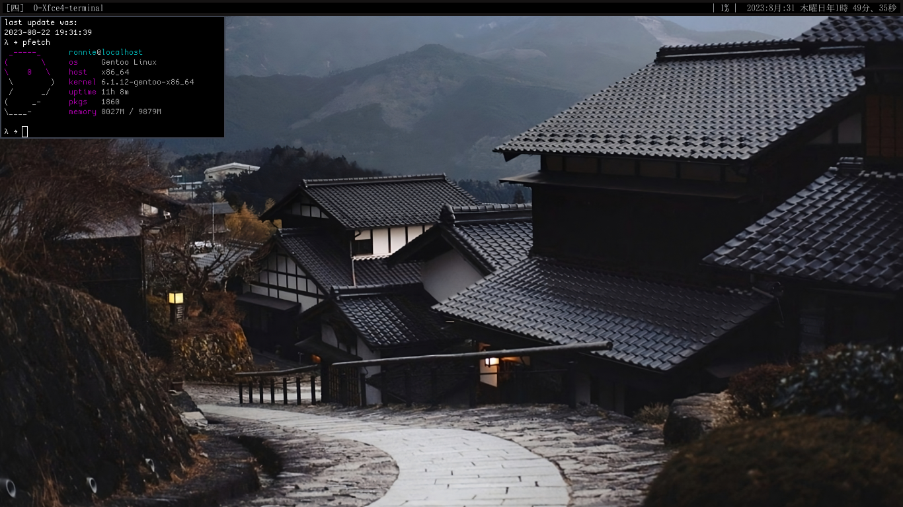
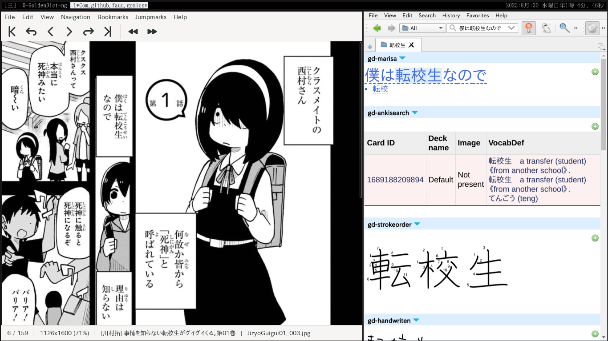

# stumpwm-senju

please consider using [that](https://github.com/goose121/clx-truetype) fork of clx-truetype, if you want to display ttf fonts.
  
Also, be aware that this my personal config, it will contain a lot of stuff that i use in the daily basis, that's why it start a lot of heavy services at the same time.

| Keybinding       | Command        | Description                              |
|------------------|----------------|------------------------------------------|
| `super-z`        | Split Horizontal | Perform a horizontal window split       |
| `super-x`        | Split Vertical   | Perform a vertical window split         |
  | `super-e`        | Emacs          | Open the Emacs text editor or find it if it's already open              |
  | `super-r`        | Remove Frame   | Close the current window frame          |
  | `super-w`        | List Frames    | List all frames within a window group   |
  | `super-;`        | Gomicsv        | open my manga reader                    |
  | `super-\ `       | OCR            | OCR with transformer_ocr for japanese   |
  | `super-.`        | OCR-Hold       | Perform OCR and retain the result       |
  | `super-shift-r`  | Reload         | Reload stupmwm without without closing anything   |
  | `meta-p`         | Rofi           | Open the Rofi application launcher      |
  | `meta-o`         | Cabl           | Execute the Cabl command                |
  | `meta-b`         | Pomodoro start | 
  | `meta-,`         | Pomodoro cancel | 
  | `meta-=`         | Pomodoro status | 
  | `meta-d`         | Open/find Goldendict |
  | `meta-2`         | Open/find Calibre    |
  | `meta-n`         | Activate mod-key     | Sometimes the mod-key (super) simply stops responding, you can revive it by pressing that keybinding. |
  | `meta-]`         | Shows clipboard manager/history with rofi                 | You will need to install greenclip for that and also my shell script called clipboard_history.sh |

   
| Navigation | 
|------------|
| `meta-h`   | 
| `meta-j`   | 
| `meta-k`   | 
| `meta-l`   | 

## Manga Workflow

## Reading Workflow 

this is possible with the new feature added to crqt-ng by tatsumoto, now you can send selected text automatically to goldendict-ng 

